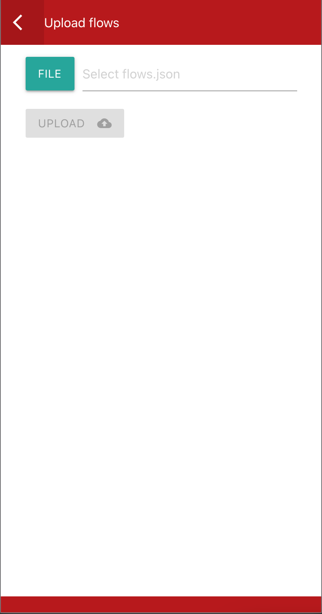

# Changelog

## [Release][5.6.2] - 2020-12-05 🚀

- Environment variables can now be added. [https://youtu.be/2ND7LPIFAGM](https://youtu.be/2ND7LPIFAGM)
- node-red-dashboard update.
- a few UI fixes.

Please join us and give us your [feedback](https://groups.google.com/g/redmobile-apps).

---

## [Test][5.6.1] - 2020-12-01 🧪

node-red-dashboard update. And a few UI fixes.

Open testing has begun.

👉 [Join Test](https://play.google.com/apps/testing/com.okhiroyuki.redmobile)

## [Test][5.6.0] - 2020-11-29 🧪

Environment variables can now be added.

[https://youtu.be/2ND7LPIFAGM](https://youtu.be/2ND7LPIFAGM)

## [Archive][5.5.2] - 2020-11-28 🗄

Specializing in things that can only be done on Android devices.
Faster startup and support for edge AI and FCM.

### Feature

- add qrcode scan node
- add mlkit node
- Support for [multiple context stores](https://nodered.org/docs/user-guide/context#using-context-in-a-flow) in Node-RED.

### Changed

- update packages
  - node-red
  - node-red-dashboard

### Removed

- node-red-contrib-aedes
- node-red-contrib-cast
- node-red-node-dropbox
- node-red-node-email
- node-red-node-pushbullet

## [Test][5.5.1] - 2020-11-28 🧪

Modified the UI slightly.

## [Test][5.5.0] - 2020-11-27 🧪

Specializing in things that can only be done on Android devices.
Faster startup and support for edge AI and FCM.

### Changed

- update packages
  - node-red
  - node-red-dashboard

### Removed

- node-red-contrib-aedes
- node-red-contrib-cast
- node-red-node-dropbox
- node-red-node-email
- node-red-node-pushbullet

## [Test][5.4.0] - 2020-11-23 🧪

Removed UI nodes that are not optimized for mobile screens and nodes that are expected to run in the background, as they cannot be guaranteed to work.

Also, modified to handle image data in Base64.

## [Test][5.3.0] - 2020-11-23 🧪

MLKit is now available. It's still in beta, so the specs may change in the future.

Also, a new camera node has been added. The existing camera nodes are deprecated and may be removed in the future.

## [Test][5.2.1] - 2020-11-22 🧪

Fixed the back button behavior of qrcode node.

## [Test][5.2.0] - 2020-11-22 🧪

Added a node for reading qrcodes.

### Changed

- add qrcode scan node

## [Test][5.1.0] - 2020-11-22 🧪

With this update, we have added support for Firebase Cloud Message.
It allows you to receive data messages via the API.

### Changed

- add fcm(Firebase Cloud Message) node
- add node-packages
  - node-red-node-ui-lineargauge
  - node-red-node-ui-list
  - node-red-node-ui-table
  - node-red-node-ui-vega

## [5.0.0] - 2020-11-21 🚀

Nothing seems to have changed, but internally we are making significant updates.
We believe that this change will make the app better.

### Changed

- Update node.js@12.19.0
- Update node-packages
  - node-red@1.2.3
  - node-red-dashboard@2.24.0

## [4.0.0] - 2020-11-15

node-red-contrib-mqtt-broker has been replaced by node-red-contrib-aedes.

Users who were using mqtt should be aware of this change.

### Added

- node-red-contrib-aedes

### Removed

- node-red-contrib-mqtt-broker

### Security

- audit fix
  - acron
  - dot-prop
  - lodash
  - minimist
  - requires

## [3.5.0] - 2020-11-01

The main content is to update the node module.

### Changes

- update node-packages
  - node-red@1.2.2
  - node-red-dashboard@2.23.5
  - node-red-node-email@1.8.2
  - node-red-node-pushbullet@0.0.17
  - node-red-contrib-string@1.0.0
  - node-red-contrib-telegrambot@8.7.1
  - node-red-contrib-ui-svg@2.0.3

## [3.4.0] - 2020-08-24

Added a node to manipulate the clipboard, which was also in [the request](https://groups.google.com/g/redmobile-apps/c/hV2_NwzHL8E/m/-jLE8-QKAgAJ).

### Added

- Clipboard Node

### Changes

- Update targetSDK@29
- Update node-packages
  - node-red@1.1.3
  - node-red-dashboard@2.23.2
  - node-red-contrib-telegrambot@8.4.0

### Fixed

- Fixed the volume node request error

## [3.3.1] - 2020-07-05

The version of Node has been updated from Series 10 to Series 12.

### Changes

- Update node.js@12.16.0
- Update node-packages
  - node-red@1.1.0
  - node-red-contrib-telegrambot@8.2.0
  - node-red-dashboard@2.22.1
  - node-red-node-feedparser@0.1.16
  - node-red-contrib-image-output@0.6.3

## [3.2.0] - 2020-04-25

The main content is to update the node module.

### Changes

- Update node-packages
  - node-red@1.0.6
  - node-red-contrib-image-output@0.5.3
  - node-red-contrib-telegrambot@7.2.0
  - node-red-dashboard@2.21.0
  - node-red-node-email@1.7.8
  - node-red-contrib-ui-svg@1.2.3

## [3.1.0] - 2020-04-03

The method of obtaining sensor data has been significantly modified.

### Changed

- Update camera node
  - When the camera is opened, the orientation of the camera can be specified.

## [2.4.0] - 2020-03-02

### Added

- node-red-contrib-string

### Changed

- Update packages
  - node-red@1.0.4
  - node-red-contrib-cast@0.2.14
  - node-red-node-email@1.7.7
  - node-red-contrib-mqtt-broker@0.2.5

## [2.3.0] - 2020-02-09

This update includes a breaking change.
The output of a serial node has been changed.

### Changed

- Update Serial node

## [2.2.3] - 2020-02-05

msg.payload has been modified from array to string in the method to take a picture of the camera node.

When using a BLE node, allow the permissions of

- android.permission.BLUETOOTH 
- android.permission.BLUETOOTH_ADMIN

### Added

- BLE node
- node-red-contrib-image-output@0.5.2
- camera node sample

### Changed

- Change the return value when taking a photo
- Update packages
  - node-red-node-email@1.7.4

## [2.0.1] - 2020-01-11

### Changed

- Update packages
  - node-red-contrib-cast@0.2.13
  - node-red-node-email@1.7.4

### Fixed

- Fixed that data cannot be overwritten by msg.payload on serial node

## [2.0.0] - 2020-01-02

### Added

- sqlite node

## [1.9.7] - 2019-12-15

### Added

- node-red-contrib-ui-svg

### Changed

- Update packages
  - node-red-dashboard@2.19.2
  - node-red-node-email@1.7.3
  - node-red-node-feedparser@0.1.15
  - node-red-node-twitter@1.1.6

## [1.9.6] - 2019-12-01

### Changed

- Update packages
  - node-red-dashboard@2.19.0
  - node-red-contrib-telegrambot@7.0.0
  - node-red-contrib-cast@0.2.12

## [1.9.5] - 2019-11-23

### Changed

- Update packages
  - node-red@1.0.3
  - node-red-node-email@1.7.2

## [1.9.4] - 2019-11-09

### Changed

- Update the serial node
- Update packages
  - node-red-contrib-telegrambot@6.0.0
  - node-red-node-base64@0.2.0

## [1.9.1] -  2019-10-19

### Changed

- Updated the vulnerable library to improve security
- Update packages
  - node-red@1.0.2
  - node-red-dashboard@2.17.1

## [1.9.0] - 2019-10-05

### Updated

- Update node-packages
  - node-red@1.0.1
  - node-red-dashboard@2.17.0

## [1.8.1] - 2019-09-08

### Added

- THe startActivity node

### Changed

- update node-packages
  - node-red@0.20.8
  - node-red-contrib-telegrambot@5.5.2
  - node-red-dashboard@2.16.2

## [1.7.1] - 2019-08-22

### Added

- The serial USB node
- The volume node that allows volume control

## [1.6.1] - 2019-08-16

### Added

- camera node

### Fixed

- Fixed background notification message

## [1.5.0] - 2019-07-21

### Chagend

- Update node-packages
  - node-red@0.20.7
  - node-red-dashboard@2.15.5
  - node-red-contrib-cast@0.2.8

## [1.4.12] - 2019-06-23

### Fixed

- Fixed AutoStart

## [1.4.11] - 2019-06-22

### Added

- Add keepAwake switch

### Changed

- Update node-packages
  - node-red@0.20.6
  - node-red-dashboard@2.15.4

## [1.4.8] - 2019-05-28

Pushbullet can be used on multiple platforms as well as IFTTT integration, so it should be useful in many ways.

### Added

- node-red-node-pushbullet.

### Updated

- update node-red-dashboard@2.15.3

## [1.4.6] - 2019-05-15

Update some modules

## [1.4.5] - 2019-05-07

### Added

- node-red-contrib-cast

## [1.4.3] - 2019-05-03

### Added

- node-red-node-dropbox

## [1.4.2] - 2019-04-30

### Added

- node-red-contrib-telegrambot

## [1.4.1] - 2019-04-30

minor bug fixes

## [1.4.0] - 2019-04-30

### Added

- dBNode
- AutoStart Switch

## [1.3.9] - 2019-04-27

### Updated

- Change support api level from 21+ to 22+

## [1.3.8] - 2019-04-27

### Changed

- Change icon
- Update ip address when app is displayed

## [1.3.7] - 2019-04-22

### Added

- Optimized background behavior (do not terminate the app with the back button)
- App Shortcuts menu ( android 7.1 or later)
  - show Dashboard
  - pinned Dashboard（Android 8.0 or later)

## [1.3.5] - 2019-04-14

minor bug fixes

## [1.3.4] - 2019-04-07

### Added

- Magnetic Sensor Node

## [1.3.3] - 2019-04-07

### Added

- Gyroscope Sensor Node

### Changed

- Update ui

## [1.3.2] - 2019-04-05

### Changed

- Update node@10.13.0
- Update node-red@0.20.5

## [1.3.1] - 2019-04-02

### Added

- The ability to update NodeRED's flows by updating local flows.json from the app.

## [1.3.0] - 2019-03-31

### Added

- dashboard access button

## [1.2.11] - 2019-03-30

### Fixed

- fixed link connection

## [1.2.10] - 2019-03-30

### Changed

- Update node icon

### Fixed

- Fixed speech synthesis node

## [1.2.9] - 2019-03-27

### Added

- add node-packages
  - node-red-contrib-mqtt-broker
  - node-red-node-base64

## [1.2.8] - 2019-03-26

### Changed

- Modified the display part of the IP address.
- With this modification, it also supports IP address display when using Wifi Hotspot.

## [1.2.7] - 2019-03-24

### Added

- add proximity node

### Changed

- change node name

## [1.2.6] - 2019-03-23

### Added

- Add new node
  - vibrate
  - dialogs node（alert, confirm, prompt, beep)
- Supports URL scheme (redmobile://)

## [1.2.5] - 2019-03-21

### Added

- add InAppBrower node

## [1.2.4] - 2019-03-21

### Added

- Add new node
  - voice recognition
  - speech synthesis

### Changed

- Update node-red@0.20.3

### Remved

- tail node

## [1.2.3] - 2019-03-19

### Added

- Add new node
  - geolocation
  - battery status

### Fixed

- fixed an internal error caused by the contents of the port
- fixed an issue where could enter a value less than zero in the port number

## [1.2.2] - 2019-03-19

### Added

- Add new node
  - motion
  - light
  - compass

## [1.1.3] - 2019-03-16

### Changed

- Update node-red@0.20.2

## [1.1.2] - 2019-03-14

### Added

- loading animation

## [1.1.1] - 2019-03-14

### Added

- Port check function

### Changes

- Speed ​​up display of server url

## [1.1.0] - 2019-03-13

### Changes

- Update node-red@0.20.0
